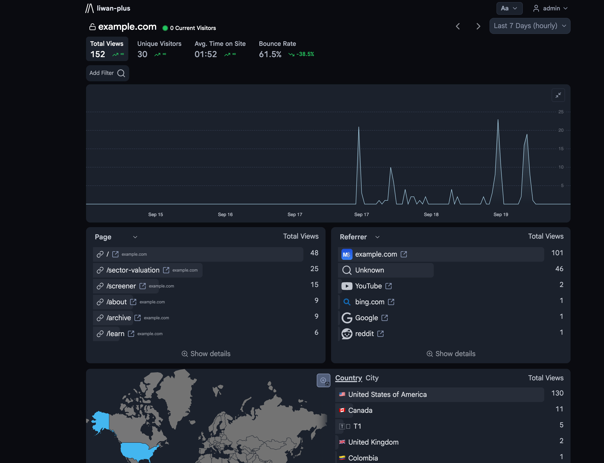
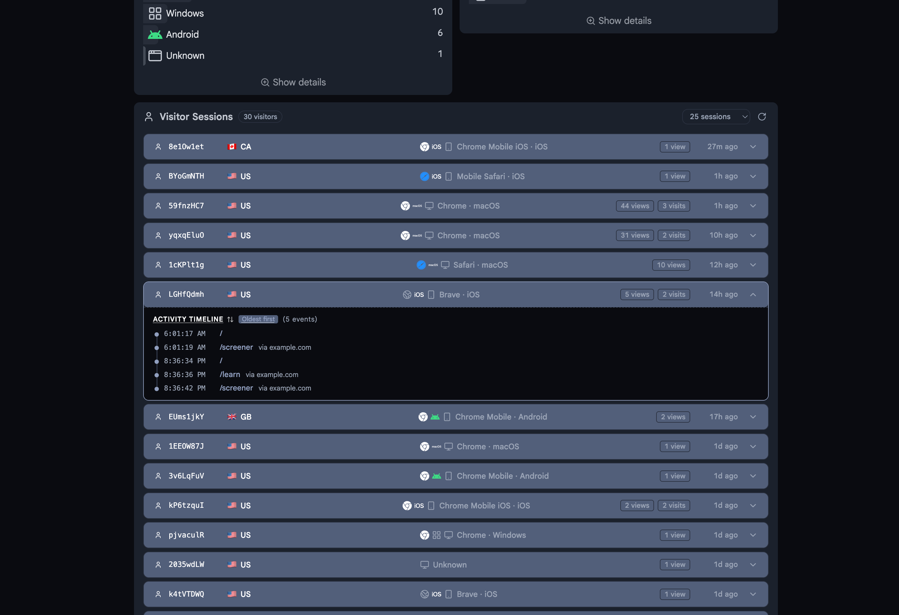

<br/>

<div align="center">
    <h2>
        
        Liwan-Plus
    </h2>
    <p><strong>Self-hosted, privacy-first web analytics with Visitor Sessions & Activity Timelines</strong></p>
    <p><em>Maintained fork of <a href="https://github.com/explodingcamera/liwan">explodingcamera/liwan</a></em></p>
<div>

[](https://github.com/chipmunk87/liwan-plus/actions)
[](LICENSE.md)

</div>

</div>

<div align="center">
  &nbsp;
  
  <br/>
  <sub><em>Left: Real-time traffic, font size toggle, map zoom lock · Right: Visitor Sessions & expandable Activity Timeline</em></sub>
</div>

---

### What Makes This Fork Different?

This edition builds directly upon Liwan's ultra-lightweight Rust + Svelte foundation, adding powerful visitor analysis and UX enhancements:

* **Visitor Sessions Drilldown**: Inspect full visitor journeys over time. See session duration, total pageviews, bounce indicators, device/OS details, and entry referrers at a glance.
* **Interactive Activity Timeline**: Click any visitor session to open an in-depth activity timeline detailing every visited path and event. Includes a clickable sort toggle to view events **oldest-to-newest** or **newest-to-oldest**.
* **12-Hour / 24-Hour Time Format Setting**: Configure your preferred time format (12h AM/PM vs. 24h clock) under *My Account* settings, reflected throughout all activity timelines.
* **Interactive Dashboard Controls**:
  * **Collapsible Traffic Chart**: Minimize the main traffic overview chart to maximize screen space for dimension cards.
  * **Map Zoom Lock**: Lock/unlock world map zooming to prevent accidental scrolling on touchscreens and trackpads.
  * **Font Scaling & Spacing**: On-screen `Aa` font size switcher with persistent local preferences.
  * **Smart Dimension Cards**: Automatically collapses low-row cards to eliminate unnecessary whitespace.

---

## Core Features

**Understand your traffic**\
See your most-visited pages, where visitors come from, and how traffic changes over time. The dashboard updates automatically, with bot filtering enabled by default.

**Easy to self-host**\
Run Liwan as a single binary or Docker container. The dashboard and embedded database are built in, with no external database services (Postgres, Redis, ClickHouse) required.

**Privacy first**\
No tracking cookies or invasive fingerprinting. Your analytics data stays exclusively on your own server.

**Collect only what you need**\
Choose what data to collect and how long to retain it. Location detail is adjustable, and campaign attribution and session metrics can be configured independently.

**Lightweight tracking script**\
Embed a tiny tracking script on your website with a single line of HTML. Compatible with any web framework, static site generator, or CMS.

**Single sign-on (SSO)**\
Manage user accounts with Google Workspace, Microsoft Entra, or your own OpenID Connect provider like Keycloak or Dex.

---

## Building from Source

### Prerequisites
* [Rust](https://www.rust-lang.org/) (latest stable)
* [Bun](https://bun.sh/) (for building the web dashboard)

### Build Steps
```bash
# 1. Build the web frontend
cd web
bun install
bun run build
cd ..

# 2. Build the Rust server binary
cargo build --release
```
The compiled binary will be located at `target/release/liwan`.

---

## Attribution & Upstream

This project is an open-source fork of [explodingcamera/liwan](https://github.com/explodingcamera/liwan), originally created by [@explodingcamera](https://github.com/explodingcamera). We are deeply grateful for their excellent foundation and architecture.

## License

Unless otherwise noted, the code in this repository is available under the terms of the **Apache-2.0** license. See [LICENSE](LICENSE.md) for more details.
